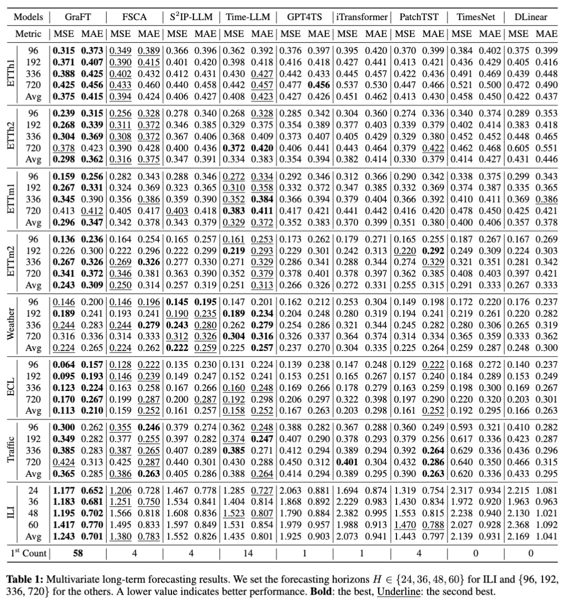
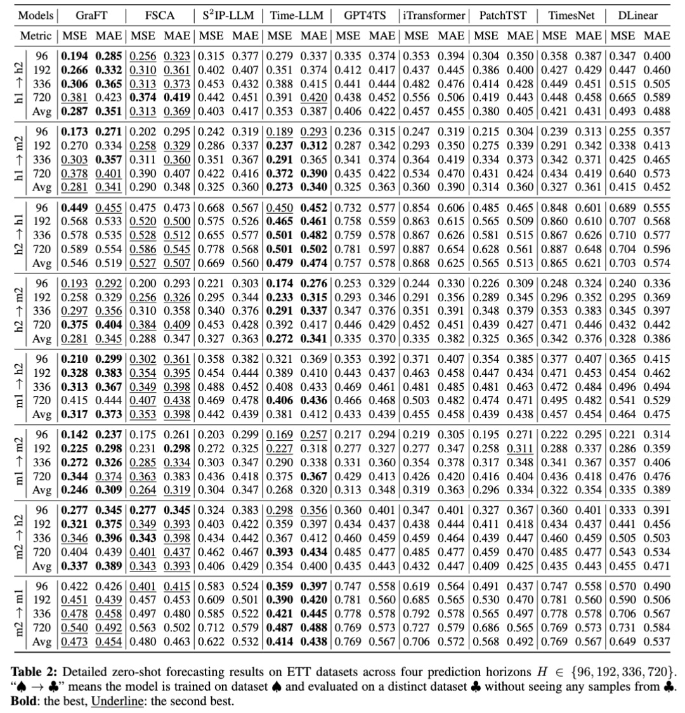
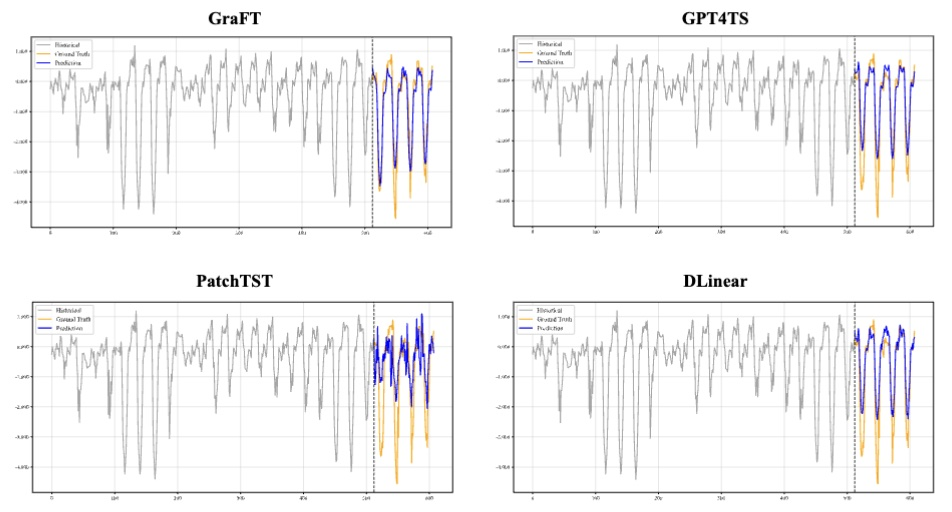
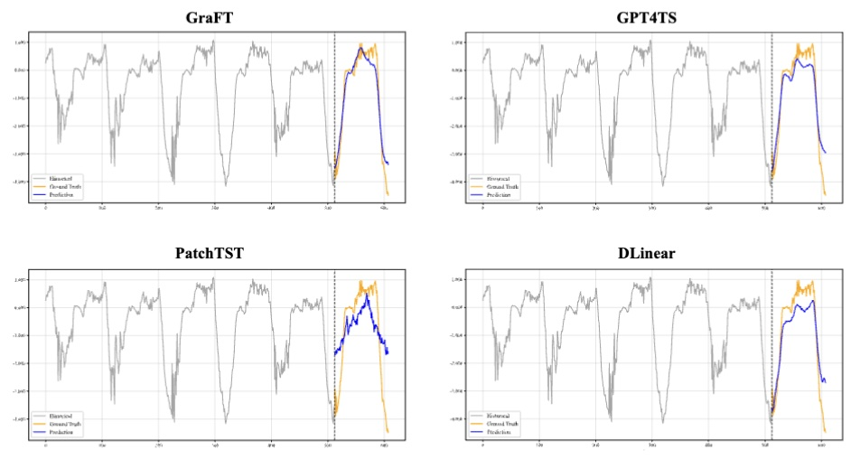
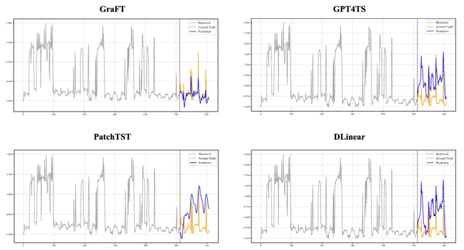
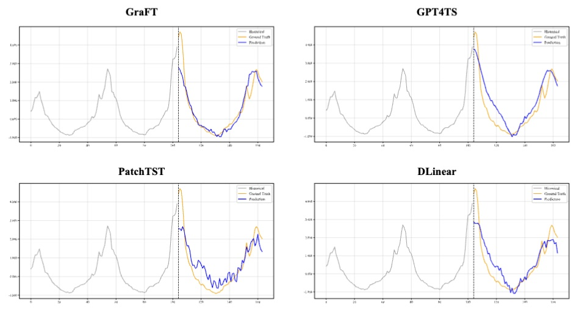
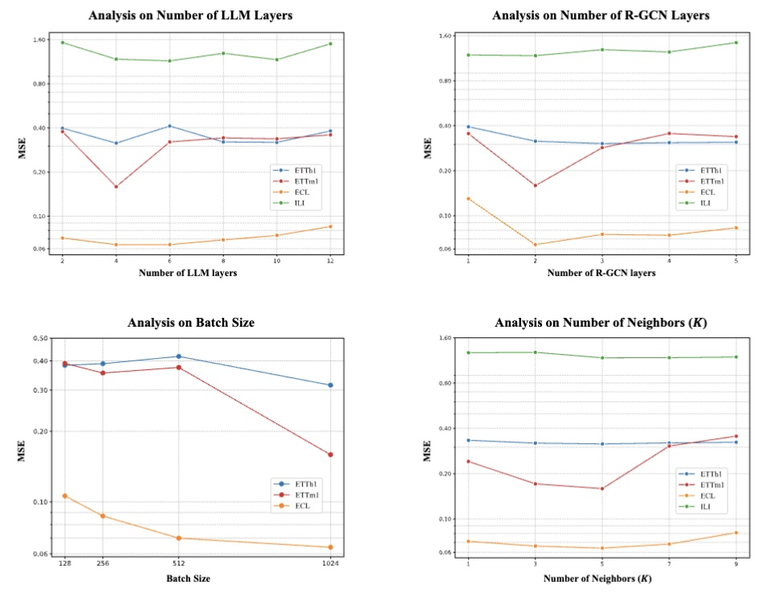

<div align="center">
  <h2><b> GraFT: Infusing Pre-trained Transformers with Relational Structure for Time Series Forecasting </b></h2>
</div>

## Table of Contents
- [Getting Started](#getting-started)
  - [1. Environment Setup](#1-environment-setup)
  - [2. Datasets](#2-datasets)
  - [3. Training & Reproduction](#3-training--reproduction)
- [Results](#results)
  - [Long-Term Forecasting](#long-term-forecasting)
  - [Zero-Shot Forecasting](#zero-shot-forecasting)
  - [Visualization of Forecasts](#visualization-of-forecasts)
  - [Hyperparameter Sensitivity](#hyperparameter-sensitivity)
- [Acknowledgements](#acknowledgements)
- [Citation](#citation)

## Getting Started

### 1. Environment Setup

This project was tested using Python 3.8 and CUDA 12.1.

Create a conda environment:
```bash
conda create -n GraFT python=3.8 -y
conda activate GraFT
```

Next, install the required dependencies by running the setup script. This script will install PyTorch and other necessary packages. Please adjust the script if you are using a different CUDA version.
```bash
bash env.sh
```

### 2. Datasets

Download the required datasets from the [TimesNet repository](https://github.com/thuml/Time-Series-Library), then place the downloaded contents under ./datasets.

### 3. Training & Reproduction

We provide experiment scripts for all benchmark datasets in the `./scripts` folder. To reproduce our results, you can run the corresponding script.

For example:
```bash
bash scripts/ETTh1/ETTh1_96.sh
```
```bash
bash scripts/ETTm1/ETTm1_96.sh
```
```bash
bash scripts/ILI/ILI_24.sh
```
```bash
bash scripts/ECL/ECL_96.sh 
```
```bash
bash scripts/Traffic/Traffic_96.sh
```
```bash
bash scripts/Weather/Weather_96.sh 
```

## Results

### Long-Term Forecasting


### Zero-Shot Forecasting


### Visualization of Forecasts
ETTh1

ETTm1

ECL 
 
ILI
 


### Hyperparameter Sensitivity



## Acknowledgements

We appreciate the following github repos a lot for their valuable code base or datasets:

*   [TimesNet](https://github.com/thuml/Time-Series-Library)
*   [PatchTST](https://github.com/yuqinie98/PatchTST)
*   [GPT4TS](https://github.com/DAMO-DI-ML/NeurIPS2023-One-Fits-All)
*   [Time-LLM](https://github.com/KimMeen/Time-LLM)
*   [FSCA](https://github.com/tokaka22/ICLR25-FSCA)
